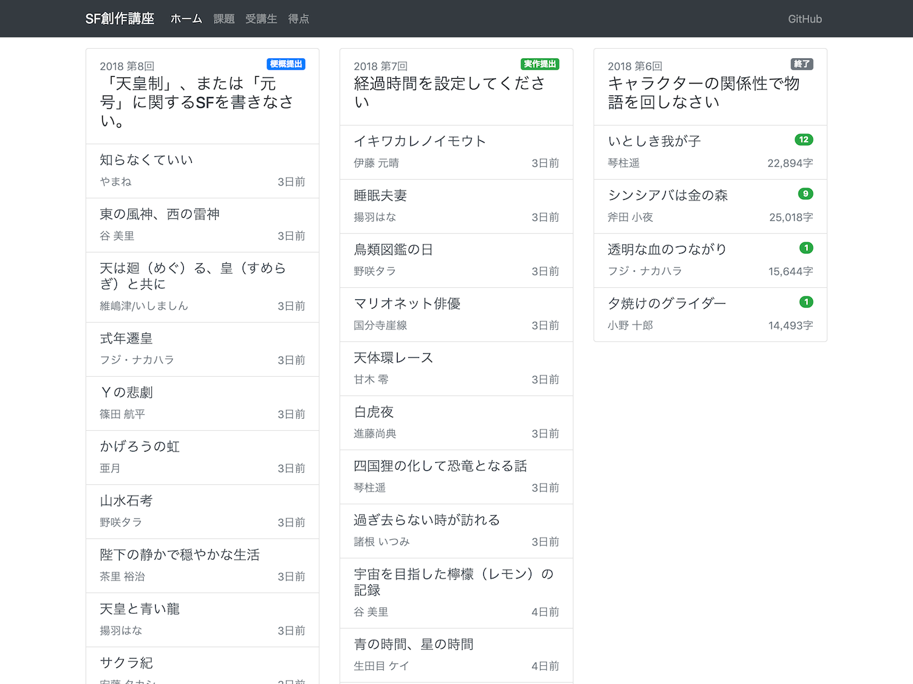

# genron-sf-app

[超・SF作家育成サイト](http://school.genron.co.jp/works/sf/) の作品を楽しむための [Ruby on Rails](https://rubyonrails.org/) アプリケーション。
  
以下の機能があります。

- 梗概や実作といったコンテンツのデータベース保存
- Web UI による快適な作品閲覧
- 課題ごとの全作品をまとめた電子書籍作成

## 要件

- Ruby 2.5
- PostgreSQL 9.2 以降

## 基本的な使い方

### 作品をダウンロードする

はじめに、以下のコマンドで依存ライブラリのインストール、データベースの作成、全コンテンツのスクレイピングを行います。  
超・SF作家育成サイトの全ページに同期的にアクセスするため、 **非常に時間がかかります** 。

    $ bin/setup

### 作品を閲覧する

データベースに保存した作品をブラウザで閲覧するには、以下のコマンドで Web サーバを起動して http://localhost:3000 にアクセスします。

    $ bin/rails server

### 作品を電子書籍化する

以下のコマンドを実行すると `output` ディレクトリに課題ごとの作品をまとめた EPUB と MOBI ファイルが作成されます。

    $ bin/rake ebook:generate YEAR=2018 NUMBER=1 # 2018年第1回課題の作品をまとめた電子書籍を作成

## 発展的な使い方

### 作品データを分析する

受講生、課題、梗概、実作といったデータを構造化してデータベースに保存しているため、様々なデータ分析が可能です。  
`Student`, `Subject`, `Synopsis`, `Work` の ActiveRecord モデルを介してアクセスすることもできます。

たとえば、以下のコマンドは2018年度の受講生を梗概の平均字数の多い順に表示します。

    $ bin/rails runner 'p Term.find(2018).students.includes(:synopses).reject { |s| s.synopses.size.zero? }.map { |s| [s.name, s.synopses.map(&:content).map(&:size).sum / s.synopses.size.to_f] }.sort { |a, b| b[1] <=> a[1] }.to_h' 

### 作品提出をツイートする

超・SF作家育成サイト 更新通知 bot (非公式) [@genron_sf_bot](https://twitter.com/genron_sf_bot) は以下のコマンドを定期実行して運用しています。

    $ bin/rake import:latest

## ライセンス

このアプリケーションは [MIT ライセンス](http://opensource.org/licenses/MIT) の下、オープンソースとして提供されています。 

